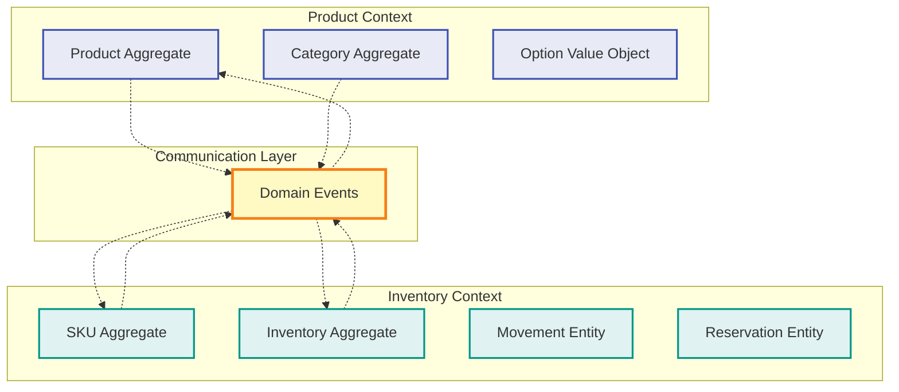
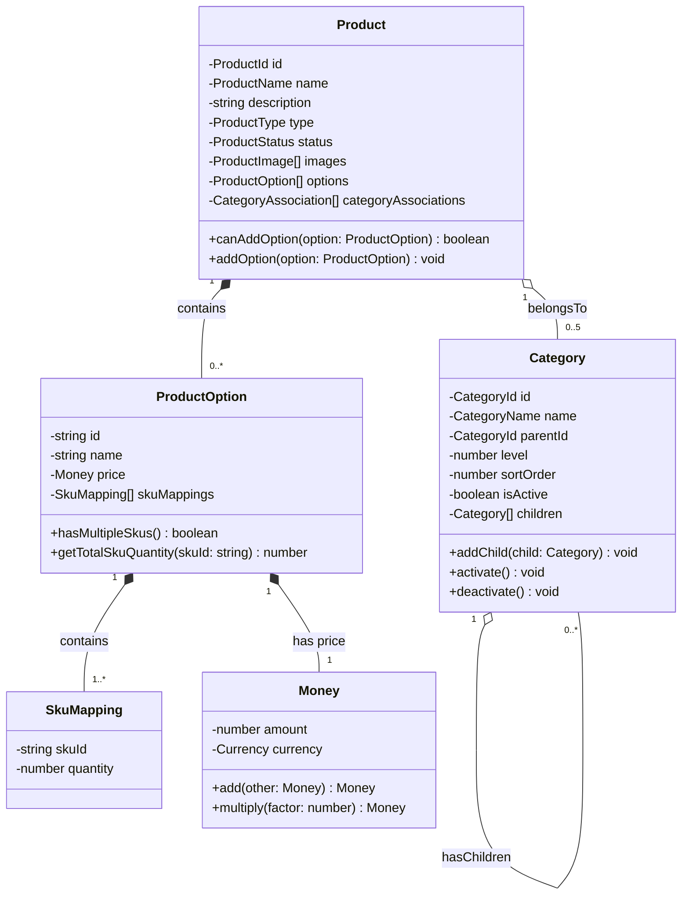
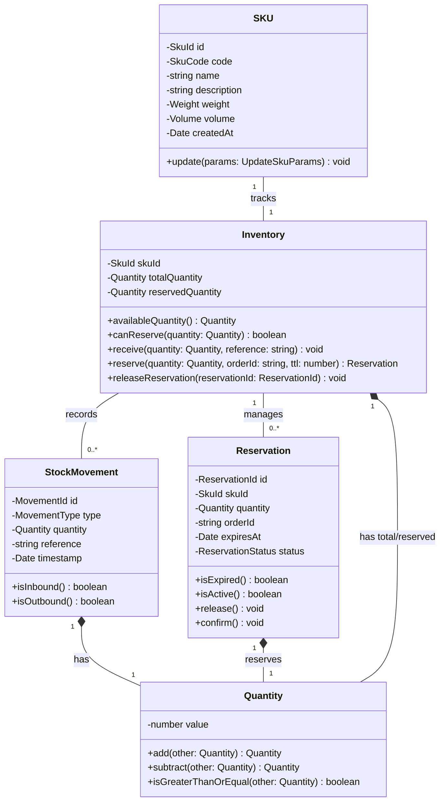
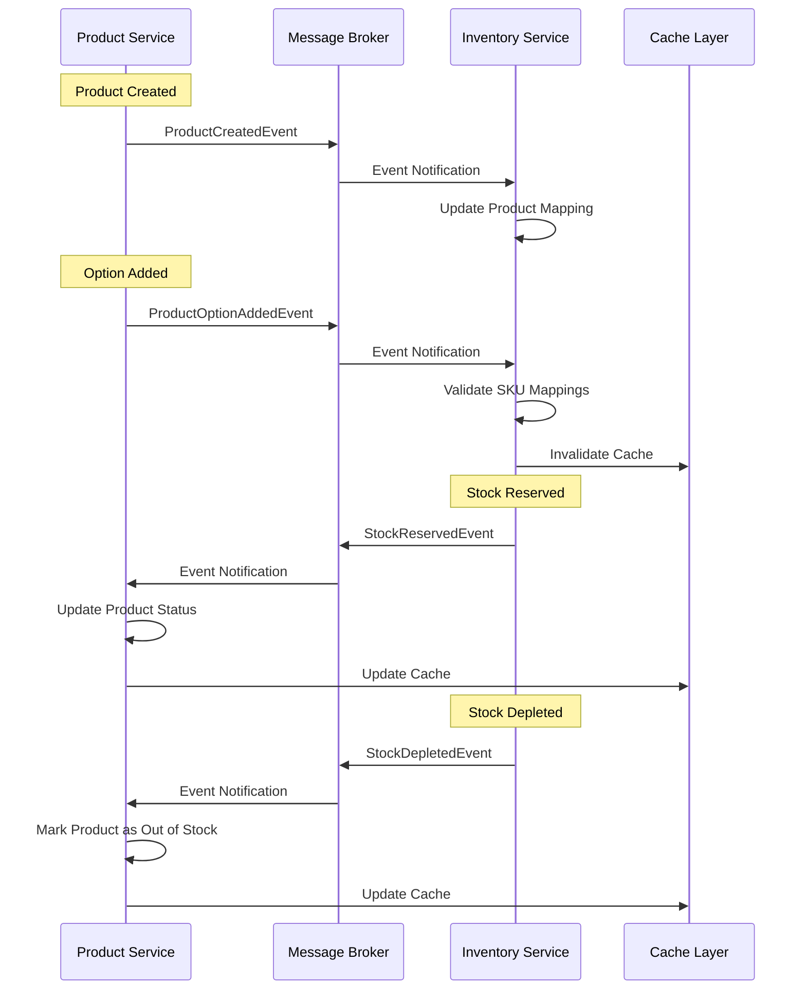

# 도메인 설계 문서

## 1. 도메인 모델 개요

### 1.1 Bounded Context
마이크로서비스 아키텍처에서 각 서비스는 독립적인 Bounded Context를 형성합니다.



### 1.2 도메인 설계 원칙
- **Aggregate 단위 트랜잭션**: 각 Aggregate는 독립적인 트랜잭션 경계
- **Eventually Consistent**: Bounded Context 간 결과적 일관성
- **Domain Event**: 도메인 변경사항을 이벤트로 전파
- **Value Object**: 불변성을 가진 값 객체 활용

## 2. Product Bounded Context



### 2.1 Product Aggregate

#### 2.1.1 Aggregate Root: Product
```typescript
class Product {
  // Identity
  private readonly id: ProductId;
  
  // Properties
  private name: ProductName;
  private description: string;
  private type: ProductType;
  private status: ProductStatus;
  private images: ProductImage[];
  
  // Associations
  private options: ProductOption[];
  private categoryAssociations: CategoryAssociation[];
  
  // Business Rules
  canAddOption(option: ProductOption): boolean {
    if (this.type === ProductType.NORMAL) {
      // 일반 상품은 여러 옵션 가능
      return true;
    }
    if (this.type === ProductType.BUNDLE) {
      // 묶음 상품 옵션 검증
      return option.hasMultipleSkus();
    }
    return false;
  }
  
  // Domain Events
  addOption(option: ProductOption): void {
    if (!this.canAddOption(option)) {
      throw new InvalidOptionException();
    }
    this.options.push(option);
    this.raise(new ProductOptionAddedEvent(this.id, option));
  }
}
```

#### 2.1.2 Value Objects

**ProductId**
```typescript
class ProductId {
  constructor(private readonly value: string) {
    if (!value || !this.isValidUuid(value)) {
      throw new InvalidProductIdException();
    }
  }
  
  equals(other: ProductId): boolean {
    return this.value === other.value;
  }
  
  toString(): string {
    return this.value;
  }
}
```

**ProductOption**
```typescript
class ProductOption {
  private readonly id: string;
  private readonly name: string;
  private readonly price: Money;
  private readonly skuMappings: SkuMapping[];
  
  constructor(params: ProductOptionParams) {
    // Validation
    if (params.skuMappings.length === 0) {
      throw new InvalidOptionException("Option must have at least one SKU");
    }
    
    this.id = params.id;
    this.name = params.name;
    this.price = new Money(params.price);
    this.skuMappings = params.skuMappings.map(m => new SkuMapping(m));
  }
  
  hasMultipleSkus(): boolean {
    return this.skuMappings.length > 1;
  }
  
  getTotalSkuQuantity(skuId: string): number {
    const mapping = this.skuMappings.find(m => m.skuId === skuId);
    return mapping ? mapping.quantity : 0;
  }
}
```

**Money**
```typescript
class Money {
  constructor(
    private readonly amount: number,
    private readonly currency: Currency = Currency.KRW
  ) {
    if (amount < 0) {
      throw new InvalidMoneyException("Amount cannot be negative");
    }
  }
  
  add(other: Money): Money {
    if (this.currency !== other.currency) {
      throw new CurrencyMismatchException();
    }
    return new Money(this.amount + other.amount, this.currency);
  }
  
  multiply(factor: number): Money {
    return new Money(this.amount * factor, this.currency);
  }
}
```

### 2.2 Category Aggregate

#### 2.2.1 Aggregate Root: Category
```typescript
class Category {
  private readonly id: CategoryId;
  private name: CategoryName;
  private parentId?: CategoryId;
  private level: number;
  private sortOrder: number;
  private isActive: boolean;
  private children: Category[] = [];
  
  // Invariants
  private validateLevel(): void {
    if (this.level > 3) {
      throw new InvalidCategoryLevelException("Maximum level is 3");
    }
  }
  
  // Business Logic
  addChild(child: Category): void {
    if (this.level >= 3) {
      throw new MaxCategoryDepthException();
    }
    
    child.setParent(this);
    this.children.push(child);
  }
  
  activate(): void {
    this.isActive = true;
    this.raise(new CategoryActivatedEvent(this.id));
  }
  
  deactivate(): void {
    if (this.hasActiveProducts()) {
      throw new CannotDeactivateCategoryException();
    }
    this.isActive = false;
    this.raise(new CategoryDeactivatedEvent(this.id));
  }
}
```

## 3. Inventory Bounded Context



### 3.1 SKU Aggregate

#### 3.1.1 Aggregate Root: SKU
```typescript
class SKU {
  private readonly id: SkuId;
  private readonly code: SkuCode;
  private name: string;
  private description?: string;
  private weight?: Weight;
  private volume?: Volume;
  private readonly createdAt: Date;
  
  constructor(params: CreateSkuParams) {
    this.id = new SkuId(params.id);
    this.code = new SkuCode(params.code);
    this.name = params.name;
    this.description = params.description;
    
    if (params.weight) {
      this.weight = new Weight(params.weight, WeightUnit.GRAM);
    }
    
    if (params.volume) {
      this.volume = new Volume(params.volume, VolumeUnit.CUBIC_CM);
    }
    
    this.createdAt = new Date();
  }
  
  update(params: UpdateSkuParams): void {
    if (params.name) this.name = params.name;
    if (params.description !== undefined) this.description = params.description;
    
    this.raise(new SkuUpdatedEvent(this.id, params));
  }
}
```

### 3.2 Inventory Aggregate

#### 3.2.1 Aggregate Root: Inventory
```typescript
class Inventory {
  private readonly skuId: SkuId;
  private totalQuantity: Quantity;
  private reservedQuantity: Quantity;
  // 성능 최적화: 대용량 컬렉션을 aggregate에서 제거
  // movements와 reservations는 별도 repository로 관리
  
  // Calculated Property
  get availableQuantity(): Quantity {
    return this.totalQuantity.subtract(this.reservedQuantity);
  }
  
  // Business Rules
  canReserve(quantity: Quantity): boolean {
    return this.availableQuantity.isGreaterThanOrEqual(quantity);
  }
  
  // Commands
  receive(quantity: Quantity, reference: string): void {
    const movement = new StockMovement({
      type: MovementType.INBOUND,
      quantity: quantity,
      reference: reference,
      timestamp: new Date()
    });
    
    // movement는 별도 repository로 저장
    this.totalQuantity = this.totalQuantity.add(quantity);
    
    this.raise(new StockReceivedEvent(this.skuId, quantity, reference));
  }
  
  reserve(quantity: Quantity, orderId: string, ttl: number): Reservation {
    if (!this.canReserve(quantity)) {
      throw new InsufficientStockException();
    }
    
    const reservation = new Reservation({
      id: ReservationId.generate(),
      skuId: this.skuId,
      quantity: quantity,
      orderId: orderId,
      expiresAt: new Date(Date.now() + ttl * 1000),
      status: ReservationStatus.ACTIVE
    });
    
    // reservation은 별도 repository로 저장
    this.reservedQuantity = this.reservedQuantity.add(quantity);
    
    this.raise(new StockReservedEvent(this.skuId, reservation));
    
    return reservation;
  }
  
  releaseReservation(reservationId: ReservationId): void {
    const reservation = this.reservations.find(r => r.id.equals(reservationId));
    
    if (!reservation || reservation.status !== ReservationStatus.ACTIVE) {
      throw new ReservationNotFoundException();
    }
    
    reservation.release();
    this.reservedQuantity = this.reservedQuantity.subtract(reservation.quantity);
    
    this.raise(new ReservationReleasedEvent(this.skuId, reservationId));
  }
}
```

#### 3.2.2 Entities

**StockMovement**
```typescript
class StockMovement {
  private readonly id: MovementId;
  private readonly type: MovementType;
  private readonly quantity: Quantity;
  private readonly reference: string;
  private readonly timestamp: Date;
  
  constructor(params: StockMovementParams) {
    this.id = MovementId.generate();
    this.type = params.type;
    this.quantity = params.quantity;
    this.reference = params.reference;
    this.timestamp = params.timestamp;
  }
  
  isInbound(): boolean {
    return this.type === MovementType.INBOUND;
  }
  
  isOutbound(): boolean {
    return this.type === MovementType.OUTBOUND;
  }
}
```

**Reservation**
```typescript
class Reservation {
  readonly id: ReservationId;
  readonly skuId: SkuId;
  readonly quantity: Quantity;
  readonly orderId: string;
  readonly expiresAt: Date;
  private status: ReservationStatus;
  
  isExpired(): boolean {
    return new Date() > this.expiresAt;
  }
  
  isActive(): boolean {
    return this.status === ReservationStatus.ACTIVE && !this.isExpired();
  }
  
  release(): void {
    if (this.status !== ReservationStatus.ACTIVE) {
      throw new InvalidReservationStateException();
    }
    this.status = ReservationStatus.RELEASED;
  }
  
  confirm(): void {
    if (!this.isActive()) {
      throw new InvalidReservationStateException();
    }
    this.status = ReservationStatus.CONFIRMED;
  }
}
```

## 4. Domain Services

### 4.1 Stock Availability Service
```typescript
interface StockAvailabilityService {
  checkProductOptionAvailability(optionId: string): Promise<AvailabilityResult>;
  checkBundleAvailability(skuMappings: SkuMapping[]): Promise<BundleAvailabilityResult>;
}

class StockAvailabilityServiceImpl implements StockAvailabilityService {
  constructor(
    private inventoryRepository: InventoryRepository,
    private productRepository: ProductRepository
  ) {}
  
  async checkProductOptionAvailability(optionId: string): Promise<AvailabilityResult> {
    const option = await this.productRepository.findOptionById(optionId);
    
    if (option.skuMappings.length === 1) {
      // 단일 SKU 옵션
      const inventory = await this.inventoryRepository.findBySkuId(option.skuMappings[0].skuId);
      return {
        isAvailable: inventory.availableQuantity.value > 0,
        availableQuantity: inventory.availableQuantity.value
      };
    }
    
    // 묶음 옵션
    return this.checkBundleAvailability(option.skuMappings);
  }
  
  async checkBundleAvailability(skuMappings: SkuMapping[]): Promise<BundleAvailabilityResult> {
    // 분산 락을 사용하여 번들 재고 확인의 원자성 보장
    const lockKey = `bundle-stock-check:${skuMappings.map(m => m.skuId).sort().join(':')}`;
    const lock = await this.distributedLock.acquire(lockKey, 5000); // 5초 타임아웃
    
    try {
      const availabilities = await Promise.all(
        skuMappings.map(async (mapping) => {
          const inventory = await this.inventoryRepository.findBySkuId(mapping.skuId);
          const availableSets = Math.floor(inventory.availableQuantity.value / mapping.quantity);
          return {
            skuId: mapping.skuId,
            requiredQuantity: mapping.quantity,
            availableQuantity: inventory.availableQuantity.value,
            availableSets
          };
        })
      );
      
      const minAvailableSets = Math.min(...availabilities.map(a => a.availableSets));
      
      return {
        isAvailable: minAvailableSets > 0,
        availableSets: minAvailableSets,
        details: availabilities
      };
    } finally {
      await lock.release();
    }
  }
  
  // 번들 재고 예약을 위한 Saga 패턴 구현
  async reserveBundleStock(skuMappings: SkuMapping[], reservationId: string): Promise<void> {
    const saga = new BundleReservationSaga(this.eventBus, this.inventoryRepository);
    
    try {
      // Saga를 통한 분산 트랜잭션 관리
      await saga.execute({
        reservationId,
        skuMappings,
        compensations: []
      });
    } catch (error) {
      // 실패 시 보상 트랜잭션 실행
      await saga.compensate();
      throw error;
    }
  }
}
```

### 4.2 Category Service
```typescript
interface CategoryService {
  buildCategoryTree(): Promise<CategoryTree>;
  getProductCategories(productId: string): Promise<Category[]>;
  assignProductToCategories(productId: string, categoryIds: string[]): Promise<void>;
}
```

## 5. Domain Events



### 5.1 Event Base Class
```typescript
abstract class DomainEvent {
  readonly eventId: string;
  readonly occurredAt: Date;
  readonly aggregateId: string;
  
  constructor(aggregateId: string) {
    this.eventId = uuid();
    this.occurredAt = new Date();
    this.aggregateId = aggregateId;
  }
  
  abstract get eventType(): string;
}
```

### 5.2 Product Domain Events
```typescript
class ProductCreatedEvent extends DomainEvent {
  constructor(
    productId: ProductId,
    public readonly name: string,
    public readonly type: ProductType
  ) {
    super(productId.toString());
  }
  
  get eventType(): string {
    return 'product.created';
  }
}

class ProductOptionAddedEvent extends DomainEvent {
  constructor(
    productId: ProductId,
    public readonly option: ProductOption
  ) {
    super(productId.toString());
  }
  
  get eventType(): string {
    return 'product.option.added';
  }
}
```

### 5.3 Inventory Domain Events
```typescript
class StockReceivedEvent extends DomainEvent {
  constructor(
    skuId: SkuId,
    public readonly quantity: Quantity,
    public readonly reference: string
  ) {
    super(skuId.toString());
  }
  
  get eventType(): string {
    return 'inventory.stock.received';
  }
}

class StockReservedEvent extends DomainEvent {
  constructor(
    skuId: SkuId,
    public readonly reservation: Reservation
  ) {
    super(skuId.toString());
  }
  
  get eventType(): string {
    return 'inventory.stock.reserved';
  }
}
```

## 6. Repository Interfaces

### 6.1 Product Repository
```typescript
interface ProductRepository {
  save(product: Product): Promise<void>;
  findById(id: ProductId): Promise<Product | null>;
  findByCategory(categoryId: CategoryId, pagination: Pagination): Promise<Page<Product>>;
  findOptionById(optionId: string): Promise<ProductOption | null>;
}
```

### 6.2 Inventory Repository
```typescript
interface InventoryRepository {
  save(inventory: Inventory): Promise<void>;
  findBySkuId(skuId: SkuId): Promise<Inventory | null>;
  findBySkuIds(skuIds: SkuId[]): Promise<Map<SkuId, Inventory>>;
  saveMovement(skuId: SkuId, movement: StockMovement): Promise<void>;
  saveReservation(reservation: Reservation): Promise<void>;
}
```

## 7. Anti-Corruption Layer

### 7.1 Product-Inventory Translation
```typescript
interface ProductInventoryTranslator {
  // Product Context → Inventory Context
  translateProductOptionToStockRequest(option: ProductOption): StockCheckRequest;
  
  // Inventory Context → Product Context
  translateStockStatusToProductAvailability(status: StockStatus): ProductAvailability;
}

class ProductInventoryTranslatorImpl implements ProductInventoryTranslator {
  translateProductOptionToStockRequest(option: ProductOption): StockCheckRequest {
    return {
      skuMappings: option.skuMappings.map(mapping => ({
        skuId: mapping.skuId,
        requiredQuantity: mapping.quantity
      }))
    };
  }
  
  translateStockStatusToProductAvailability(status: StockStatus): ProductAvailability {
    return {
      isAvailable: status.availableQuantity > 0,
      stockLevel: this.getStockLevel(status.availableQuantity),
      message: this.getAvailabilityMessage(status)
    };
  }
  
  private getStockLevel(quantity: number): StockLevel {
    if (quantity === 0) return StockLevel.OUT_OF_STOCK;
    if (quantity < 10) return StockLevel.LOW;
    return StockLevel.IN_STOCK;
  }
}
```

## 8. 도메인 규칙 및 불변성

### 8.1 Product Domain Rules
1. **상품 타입 불변성**: 생성 후 상품 타입 변경 불가
2. **옵션 검증**: 묶음 상품은 복수 SKU 옵션만 허용
3. **카테고리 제한**: 상품당 최대 5개 카테고리 연결
4. **가격 정책**: 옵션 가격은 0 이상

### 8.2 Inventory Domain Rules
1. **재고 음수 불가**: 재고 수량은 항상 0 이상
2. **선점 제한**: 가용 재고 이상 선점 불가
3. **선점 만료**: 만료된 선점은 자동 해제
4. **이동 추적**: 모든 재고 변동은 이력 보존

### 8.3 Category Domain Rules
1. **계층 제한**: 최대 3단계 깊이
2. **순환 참조 금지**: 부모-자식 순환 불가
3. **활성 상품 보호**: 활성 상품이 있는 카테고리 비활성화 불가

## 9. 도메인 예외

### 9.1 Product Domain Exceptions
```typescript
class ProductDomainException extends Error {}
class InvalidProductIdException extends ProductDomainException {}
class InvalidOptionException extends ProductDomainException {}
class DuplicateOptionException extends ProductDomainException {}
class MaxCategoryLimitException extends ProductDomainException {}
```

### 9.2 Inventory Domain Exceptions
```typescript
class InventoryDomainException extends Error {}
class InsufficientStockException extends InventoryDomainException {}
class InvalidQuantityException extends InventoryDomainException {}
class ReservationNotFoundException extends InventoryDomainException {}
class ExpiredReservationException extends InventoryDomainException {}
```

## 10. 도메인 테스트 시나리오

### 10.1 Product Domain Tests
```typescript
describe('Product Aggregate', () => {
  it('should create normal product with single SKU option', () => {
    // Given
    const product = new Product({
      id: ProductId.generate(),
      name: '티셔츠',
      type: ProductType.NORMAL
    });
    
    // When
    const option = new ProductOption({
      name: '블랙 - L',
      skuMappings: [{ skuId: 'SKU001', quantity: 1 }]
    });
    product.addOption(option);
    
    // Then
    expect(product.options).toHaveLength(1);
    expect(product.domainEvents).toContainEqual(
      expect.objectContaining({ eventType: 'product.option.added' })
    );
  });
});
```

### 10.2 Inventory Domain Tests
```typescript
describe('Inventory Aggregate', () => {
  it('should reserve stock when sufficient quantity available', () => {
    // Given
    const inventory = new Inventory({ skuId: 'SKU001', totalQuantity: 100 });
    
    // When
    const reservation = inventory.reserve(10, 'ORDER001', 3600);
    
    // Then
    expect(inventory.availableQuantity.value).toBe(90);
    expect(reservation.status).toBe(ReservationStatus.ACTIVE);
  });
});
```

### 3.3 Repository 인터페이스

#### 3.3.1 성능 최적화를 위한 분리된 Repository
```typescript
// Inventory Repository
interface InventoryRepository {
  findBySkuId(skuId: SkuId): Promise<Inventory>;
  save(inventory: Inventory): Promise<void>;
}

// StockMovement Repository (성능 최적화)
interface StockMovementRepository {
  findBySkuId(skuId: SkuId, limit?: number, offset?: number): Promise<StockMovement[]>;
  save(movement: StockMovement): Promise<void>;
  countBySkuId(skuId: SkuId): Promise<number>;
}

// Reservation Repository (성능 최적화)
interface ReservationRepository {
  findBySkuId(skuId: SkuId, status?: ReservationStatus): Promise<Reservation[]>;
  findById(id: ReservationId): Promise<Reservation>;
  save(reservation: Reservation): Promise<void>;
  deleteExpired(): Promise<number>;
}
```