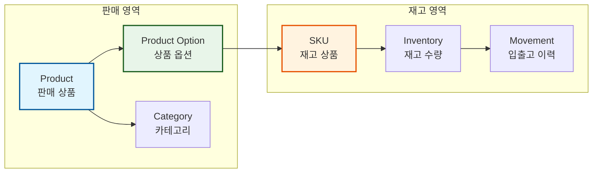
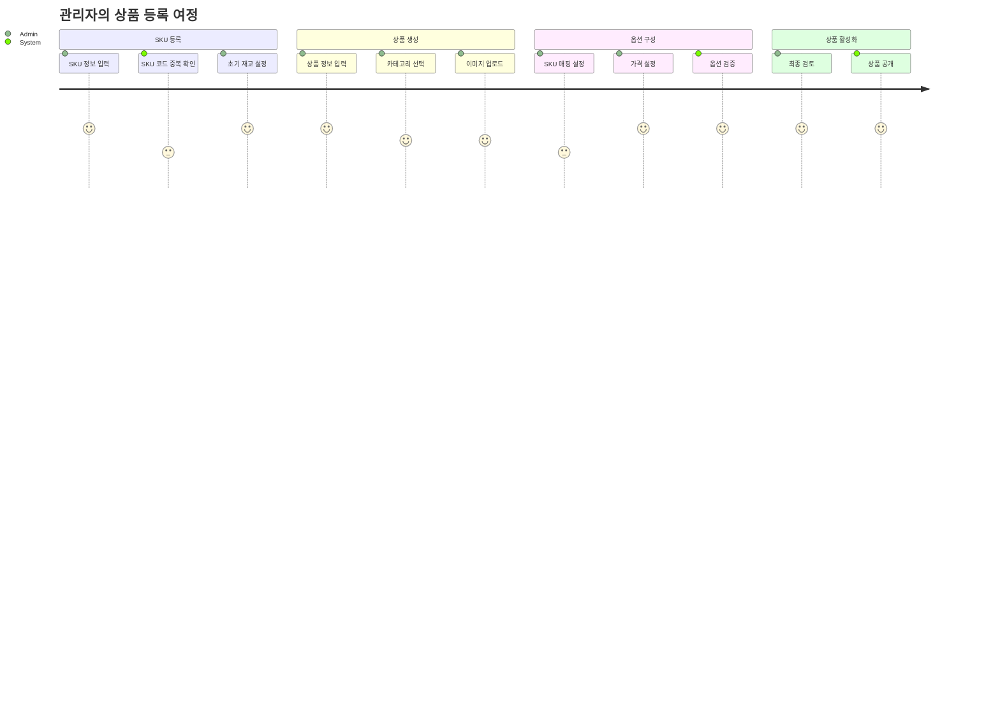

# 상품 관리 시스템 PRD (Product Requirements Document)

## 1. 프로젝트 개요

### 1.1 목적
마이크로서비스 아키텍처 기반의 이커머스 플랫폼에서 상품, 옵션, 재고, 카테고리를 효율적으로 관리하기 위한 시스템 구축

### 1.2 범위
- 상품 관리 서비스 (Product Service)
- 재고 관리 서비스 (Inventory Service)
- 카테고리 관리 기능
- 상품-재고 연동 인터페이스

### 1.3 핵심 가치
- **확장성**: 대용량 상품 카탈로그 처리 가능
- **유연성**: 다양한 상품 유형 지원 (단품, 묶음)
- **실시간성**: 정확한 재고 정보 제공
- **독립성**: 서비스 간 느슨한 결합

## 2. 용어 정의



| 용어 | 영문명 | 설명 |
|------|--------|------|
| **재고 상품** | SKU (Stock Keeping Unit) | 실물 재고 단위, 수량을 보유하며 입출고 대상 |
| **판매 상품** | Product | 사용자에게 노출되는 판매 단위, 마케팅/기획 중심 |
| **상품 옵션** | Product Option | 실제 구매 선택 단위, SKU 또는 SKU 조합과 연결 |
| **카테고리** | Category | 상품 분류 체계로, 1~3단계로 구성되며 상품에 다중 연결 가능 |
| **묶음 상품** | Bundle Product | 여러 SKU를 조합하여 판매하는 상품 |

## 3. 사용자 스토리



### 3.1 관리자 (Admin)
- **AS-001**: 관리자는 신규 SKU를 등록하고 초기 재고를 설정할 수 있다
- **AS-002**: 관리자는 판매 상품을 생성하고 옵션을 구성할 수 있다
- **AS-003**: 관리자는 카테고리를 생성/수정하고 상품을 분류할 수 있다
- **AS-004**: 관리자는 재고 입출고를 처리하고 이력을 조회할 수 있다
- **AS-005**: 관리자는 묶음 상품을 생성하고 구성 SKU를 설정할 수 있다

### 3.2 구매자 (Customer)
- **CS-001**: 구매자는 카테고리별로 상품을 조회할 수 있다
- **CS-002**: 구매자는 상품의 옵션과 재고 상태를 확인할 수 있다
- **CS-003**: 구매자는 품절된 상품을 구분하여 볼 수 있다

### 3.3 시스템 (System)
- **SS-001**: 시스템은 옵션별 재고 상태를 실시간으로 계산한다
- **SS-002**: 시스템은 묶음 옵션의 가용 수량을 자동 산출한다
- **SS-003**: 시스템은 재고 변동 이력을 추적 관리한다

## 4. 기능 요구사항

### 4.1 재고 상품 (SKU) 관리

#### 4.1.1 SKU 등록
- **FR-SKU-001**: SKU 코드는 전역적으로 유일해야 한다
- **FR-SKU-002**: SKU 기본 정보 관리 (코드, 이름, 설명, 무게, 부피)
- **FR-SKU-003**: 초기 재고 수량 설정 기능

#### 4.1.2 재고 관리
- **FR-INV-001**: 입고/출고/조정 처리
- **FR-INV-002**: 재고 선점/해제 기능
- **FR-INV-003**: 실시간 가용 재고 = 총 재고 - 선점 재고
- **FR-INV-004**: 재고 변동 이력 추적

### 4.2 판매 상품 (Product) 관리

#### 4.2.1 상품 등록
- **FR-PRD-001**: 상품 타입 구분 (NORMAL, BUNDLE)
- **FR-PRD-002**: 상품 기본 정보 관리 (이름, 설명, 이미지, 상태)
- **FR-PRD-003**: 다중 카테고리 연결 지원

#### 4.2.2 옵션 관리
- **FR-OPT-001**: 상품당 0개 이상의 옵션 등록
- **FR-OPT-002**: 단일 옵션은 1개 SKU 참조
- **FR-OPT-003**: 묶음 옵션은 N개 SKU와 수량 정보 보유
- **FR-OPT-004**: 옵션별 가격, 상태, 속성 관리

### 4.3 카테고리 관리

#### 4.3.1 카테고리 구조
- **FR-CAT-001**: 최대 3단계 트리 구조 지원
- **FR-CAT-002**: 부모-자식 관계 관리
- **FR-CAT-003**: 카테고리별 정렬 순서 지원

#### 4.3.2 상품 분류
- **FR-CAT-004**: 상품-카테고리 N:M 관계 지원
- **FR-CAT-005**: 대표 카테고리 지정 기능
- **FR-CAT-006**: 카테고리별 상품 목록 조회

### 4.4 재고 연동

#### 4.4.1 품절 판단
- **FR-STC-001**: 단일 옵션: SKU 재고 0일 때 품절
- **FR-STC-002**: 묶음 옵션: MIN(SKU 재고 ÷ 구성 수량) = 0일 때 품절

#### 4.4.2 API 연동
- **FR-API-001**: 상품 조회 시 재고 정보 병합
- **FR-API-002**: 재고 서비스 호출 실패 시 캐시 활용
- **FR-API-003**: 대량 재고 조회 배치 API 제공

## 5. 비기능 요구사항

### 5.1 성능
- **NFR-PRF-001**: 상품 목록 조회 응답시간 < 200ms
- **NFR-PRF-002**: 재고 확인 API 응답시간 < 100ms
- **NFR-PRF-003**: 동시 1,000건 재고 조회 처리 가능

### 5.2 확장성
- **NFR-SCL-001**: 100만 개 이상 SKU 관리 가능
- **NFR-SCL-002**: 시간당 10만 건 재고 업데이트 처리
- **NFR-SCL-003**: 수평적 확장 지원 (Kubernetes)

### 5.3 가용성
- **NFR-AVL-001**: 99.9% 이상 가용성 보장
- **NFR-AVL-002**: 재고 서비스 장애 시 Fallback 처리
- **NFR-AVL-003**: 무중단 배포 지원

### 5.4 보안
- **NFR-SEC-001**: API 인증/인가 (JWT)
- **NFR-SEC-002**: 역할 기반 접근 제어 (RBAC)
- **NFR-SEC-003**: 민감 데이터 암호화

## 6. 제약사항

### 6.1 기술적 제약
- Node.js/TypeScript 기반 구현
- PostgreSQL 데이터베이스 사용
- gRPC/REST API 통신
- Docker/Kubernetes 환경

### 6.2 비즈니스 제약
- 재고는 음수가 될 수 없음
- 삭제된 SKU는 복구 불가
- 카테고리 최대 깊이 3단계

## 7. 인터페이스 명세

### 7.1 상품 서비스 API

#### 상품 조회
```
GET /api/products/{productId}
Response: Product + Options + Stock Status
```

#### 카테고리별 상품 목록
```
GET /api/categories/{categoryId}/products
Query: page, size, sort
Response: Paginated Product List
```

### 7.2 재고 서비스 API

#### 재고 조회
```
GET /api/inventory/skus/{skuId}
Response: Stock Quantity, Reserved Quantity
```

#### 재고 선점
```
POST /api/inventory/reservations
Body: SKU ID, Quantity, Order ID
Response: Reservation ID
```

## 8. 데이터 모델 개요

### 8.1 상품 도메인
- Product (상품)
- ProductOption (옵션)
- Category (카테고리)
- ProductCategory (상품-카테고리 연결)

### 8.2 재고 도메인
- SKU (재고 상품)
- Inventory (재고 수량)
- StockMovement (재고 이동)
- Reservation (재고 선점)

## 9. 마일스톤

### Phase 1: 기본 구현 (4주)
- SKU/재고 관리 기능
- 상품/옵션 관리 기능
- 기본 API 구현

### Phase 2: 고도화 (3주)
- 카테고리 관리 기능
- 묶음 상품 지원
- 재고 연동 최적화

### Phase 3: 운영 준비 (3주)
- 성능 최적화
- 모니터링 구축
- 문서화 및 테스트

## 10. 리스크 및 대응 방안

### 10.1 기술적 리스크
- **리스크**: 재고 동시성 이슈
- **대응**: 분산 락, 이벤트 소싱 적용

### 10.2 비즈니스 리스크
- **리스크**: 재고 정합성 불일치
- **대응**: 정기 재고 실사, 조정 프로세스

## 11. 성공 지표

### 11.1 정량적 지표
- API 응답 시간 목표 달성률 > 95%
- 재고 정확도 > 99.5%
- 시스템 가용성 > 99.9%

### 11.2 정성적 지표
- 관리자 업무 효율성 향상
- 고객 상품 검색 경험 개선
- 재고 관리 정확성 증대

## 12. 참고 자료

- 마이크로서비스 아키텍처 가이드
- DDD (Domain-Driven Design) 원칙
- 이커머스 도메인 모델링 베스트 프랙티스