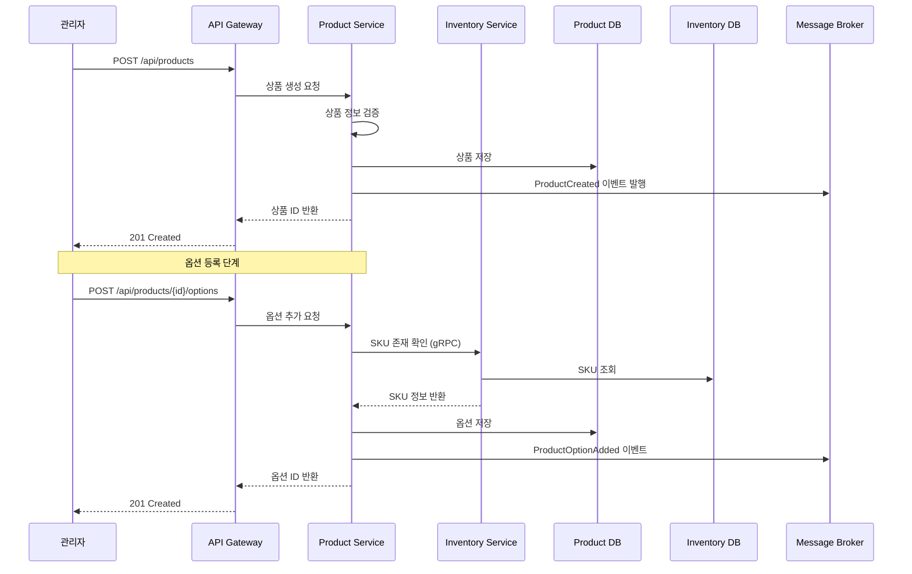
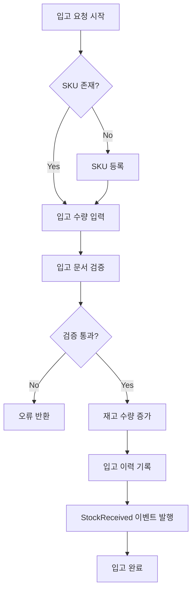
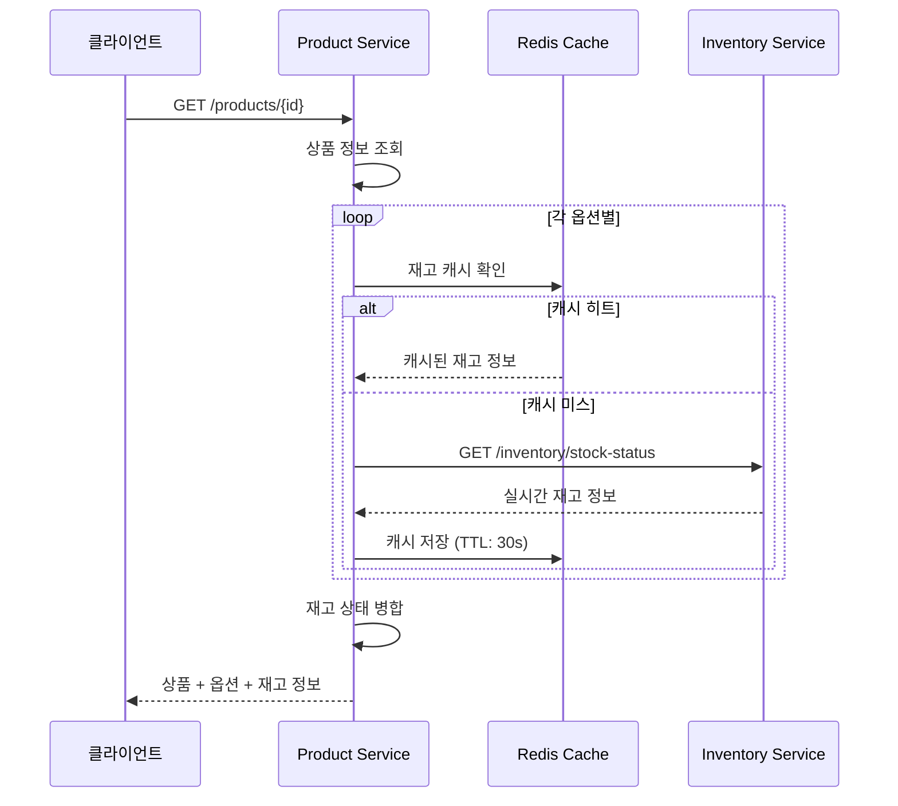
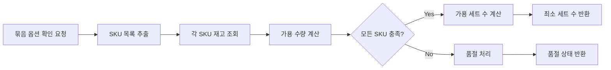
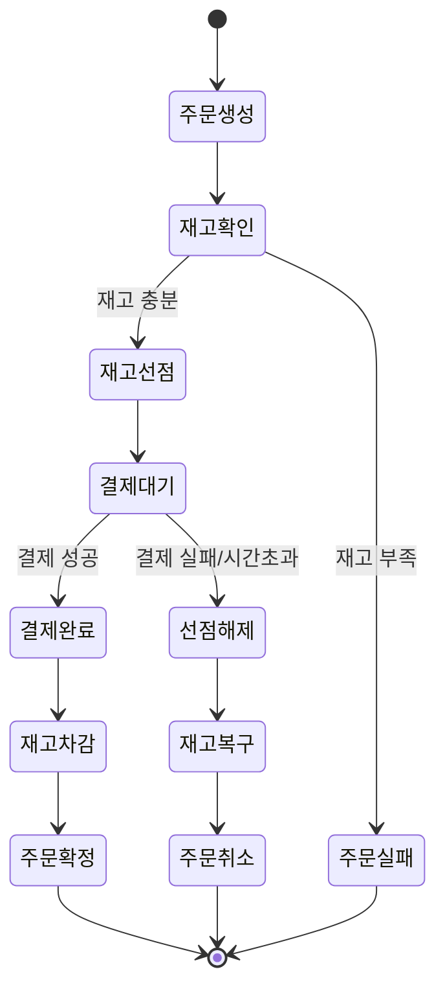
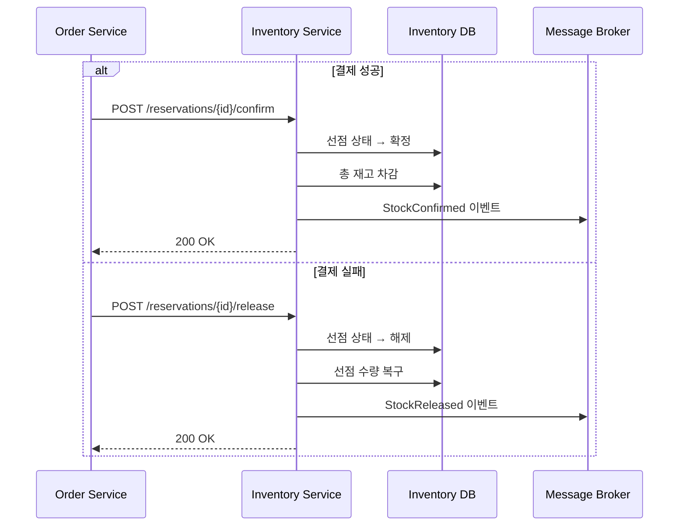
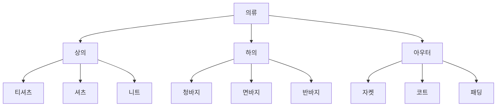
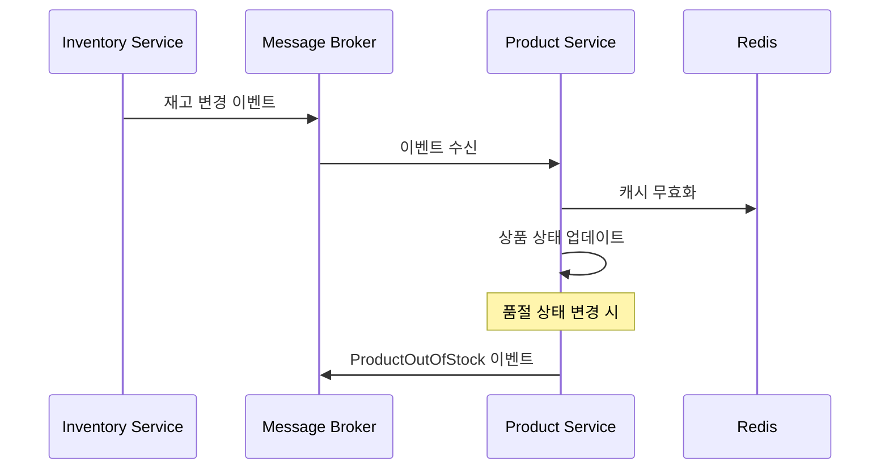
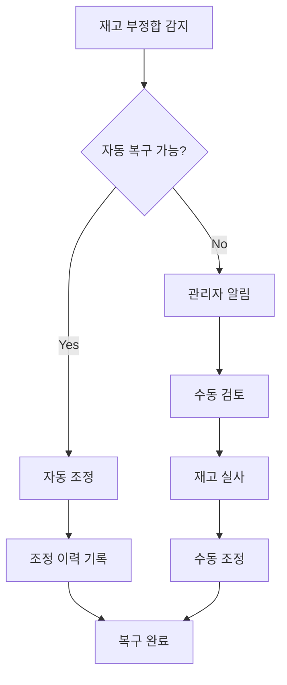

# 주요 프로세스 흐름 문서

## 1. 개요

이 문서는 상품 관리 시스템의 주요 비즈니스 프로세스와 시스템 간 상호작용을 설명합니다.

## 2. 상품 등록 프로세스

### 2.1 프로세스 개요
관리자가 신규 상품을 등록하는 전체 프로세스

### 2.2 시퀀스 다이어그램



### 2.3 프로세스 단계

1. **상품 기본 정보 등록**
   - 상품명, 설명, 타입 입력
   - 상품 이미지 업로드
   - 카테고리 선택

2. **SKU 매핑 확인**
   - 재고 서비스에서 SKU 존재 여부 확인
   - SKU 정보 검증

3. **옵션 구성**
   - 단일 상품: 1개 SKU 매핑
   - 묶음 상품: N개 SKU + 수량 매핑

4. **가격 설정**
   - 옵션별 판매 가격 설정
   - 통화 단위 확인

5. **상품 활성화**
   - 최종 검증
   - 상품 상태 변경

## 3. 재고 입고 프로세스

### 3.1 프로세스 개요
창고에서 실물 재고를 입고 처리하는 프로세스

### 3.2 플로우 차트



### 3.3 API 호출 흐름

```yaml
# 1. SKU 등록 (신규인 경우)
POST /api/inventory/skus
Body:
  code: "SKU12345"
  name: "티셔츠 - 블랙 - L"
  weight: 200
  volume: 1000

# 2. 재고 입고
POST /api/inventory/skus/{skuId}/receive
Body:
  quantity: 100
  reference: "PO-2024-001"
  
# 3. 이벤트 발행
Event: inventory.stock.received
Payload:
  skuId: "SKU12345"
  quantity: 100
  totalQuantity: 100
  timestamp: "2024-01-01T10:00:00Z"
```

## 4. 상품 구매 가능성 확인 프로세스

### 4.1 프로세스 개요
고객이 상품 상세 페이지에서 옵션별 구매 가능 여부를 확인하는 프로세스

### 4.2 단일 옵션 재고 확인



### 4.3 묶음 옵션 재고 확인



#### 계산 로직
```typescript
// 묶음 상품 가용 수량 계산
function calculateBundleAvailability(skuMappings, inventories) {
  const availableSets = skuMappings.map(mapping => {
    const inventory = inventories.get(mapping.skuId);
    const available = inventory.availableQuantity;
    return Math.floor(available / mapping.quantity);
  });
  
  return Math.min(...availableSets);
}

// 예시:
// SKU-A: 재고 100개, 필요 2개 → 50세트 가능
// SKU-B: 재고 60개, 필요 3개 → 20세트 가능
// 결과: 20세트 구매 가능
```

## 5. 주문 시 재고 처리 프로세스

### 5.1 프로세스 개요
주문 생성부터 재고 차감까지의 전체 흐름

### 5.2 상태 다이어그램



### 5.3 재고 선점 프로세스

```yaml
# 1. 재고 선점 요청
POST /api/inventory/reservations
Body:
  items:
    - skuId: "SKU001"
      quantity: 2
    - skuId: "SKU002"
      quantity: 1
  orderId: "ORDER-123"
  ttl: 900  # 15분

# 2. 선점 성공 응답
Response:
  reservations:
    - reservationId: "RES-001"
      skuId: "SKU001"
      quantity: 2
      expiresAt: "2024-01-01T10:15:00Z"
    - reservationId: "RES-002"
      skuId: "SKU002"
      quantity: 1
      expiresAt: "2024-01-01T10:15:00Z"

# 3. 이벤트 발행
Event: inventory.stock.reserved
Payload:
  orderId: "ORDER-123"
  reservations: [...]
```

### 5.4 재고 확정/해제 프로세스



## 6. 카테고리 관리 프로세스

### 6.1 카테고리 트리 구성



### 6.2 상품-카테고리 연결 프로세스

```yaml
# 1. 카테고리 생성
POST /api/categories
Body:
  name: "티셔츠"
  parentId: "category-상의"
  sortOrder: 1

# 2. 상품에 카테고리 할당
POST /api/products/{productId}/categories
Body:
  categoryIds: ["cat-001", "cat-002", "cat-003"]
  primaryCategoryId: "cat-001"

# 3. 카테고리별 상품 조회
GET /api/categories/{categoryId}/products?page=1&size=20
Response:
  products: [...]
  pagination: {...}
```

## 7. 재고 동기화 프로세스

### 7.1 실시간 동기화



### 7.2 배치 동기화

```yaml
# 일일 재고 정합성 검증
Schedule: "0 2 * * *"  # 매일 새벽 2시

Process:
  1. 전체 SKU 목록 조회
  2. 실물 재고와 시스템 재고 비교
  3. 불일치 항목 리포트 생성
  4. 관리자 알림 발송
```

## 8. 에러 처리 및 복구 프로세스

### 8.1 재고 부정합 처리



### 8.2 서비스 장애 대응

```yaml
Scenario: Inventory Service 장애

Fallback Strategy:
  1. Redis 캐시에서 최근 재고 정보 제공
  2. "재고 확인 중" 상태로 표시
  3. 구매는 가능하되 확정은 지연
  4. 서비스 복구 후 일괄 처리

Circuit Breaker:
  failureThreshold: 5
  timeout: 3000ms
  resetTimeout: 30s
```

## 9. 모니터링 및 알림

### 9.1 주요 모니터링 지표

```yaml
Business Metrics:
  - 시간당 상품 조회수
  - 재고 정확도 (%)
  - 품절 상품 비율
  - 평균 재고 회전율

Technical Metrics:
  - API 응답 시간
  - 재고 조회 캐시 히트율
  - 이벤트 처리 지연시간
  - 에러율
```

### 9.2 알림 규칙

```yaml
Alerts:
  - name: "재고 부정합"
    condition: "discrepancy > 5%"
    severity: "HIGH"
    
  - name: "대량 품절"
    condition: "out_of_stock_rate > 20%"
    severity: "MEDIUM"
    
  - name: "API 지연"
    condition: "response_time > 500ms"
    severity: "LOW"
```

## 10. 성능 최적화 전략

### 10.1 캐싱 전략

```yaml
Cache Layers:
  1. CDN: 상품 이미지 (24시간)
  2. API Gateway: 상품 목록 (5분)
  3. Application: 상품 상세 (10분)
  4. Redis: 재고 정보 (30초)

Cache Invalidation:
  - Event-driven: 재고 변경 시 즉시
  - TTL-based: 설정된 시간 경과
  - Manual: 관리자 요청
```

### 10.2 쿼리 최적화

```sql
-- 상품 목록 조회 최적화
CREATE INDEX idx_product_category ON product_categories(category_id, product_id);
CREATE INDEX idx_product_status ON products(status, created_at);

-- 재고 조회 최적화
CREATE INDEX idx_inventory_sku ON inventory(sku_id);
CREATE INDEX idx_reservation_status ON reservations(status, expires_at);
```