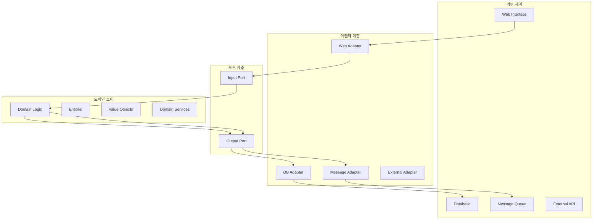

# 아키텍처 문서

## 헥사고날 아키텍처 (Hexagonal Architecture)

### 개요
헥사고날 아키텍처는 Alistair Cockburn이 제안한 아키텍처 패턴으로, 포트와 어댑터 패턴이라고도 불립니다. 이 아키텍처의 핵심은 비즈니스 로직을 외부 세계로부터 격리하는 것입니다.

### 구조



### 계층별 역할

#### 1. 도메인 코어 (Core Domain)
- **위치**: `core/` 디렉토리
- **역할**: 비즈니스 로직의 핵심
- **포함 요소**:
  - 도메인 엔티티 (Entities)
  - 값 객체 (Value Objects)
  - 도메인 서비스 (Domain Services)
  - 애그리게이트 루트 (Aggregate Roots)

```java
// 예시: 도메인 엔티티
public class Order extends AggregateRoot<OrderId> {
    private final OrderId id;
    private final CustomerId customerId;
    private final List<OrderItem> items;
    private OrderStatus status;
    
    public void cancel() {
        if (status == OrderStatus.SHIPPED) {
            throw new OrderCannotBeCancelledException();
        }
        this.status = OrderStatus.CANCELLED;
        addDomainEvent(new OrderCancelledEvent(this.id));
    }
}
```

#### 2. 애플리케이션 계층 (Application Layer)
- **위치**: `core/` 디렉토리 내 application 패키지
- **역할**: 유스케이스 조합 및 트랜잭션 관리
- **포함 요소**:
  - 유스케이스 (Use Cases)
  - 애플리케이션 서비스 (Application Services)

```java
// 예시: 애플리케이션 서비스
@Service
@Transactional
public class OrderApplicationService {
    
    public CreateOrderResponse createOrder(CreateOrderRequest request) {
        // 1. 도메인 객체 생성
        Order order = Order.create(request.getCustomerId(), request.getItems());
        
        // 2. 도메인 규칙 검증
        orderValidator.validate(order);
        
        // 3. 저장
        Order savedOrder = orderRepository.save(order);
        
        // 4. 도메인 이벤트 발행
        publishDomainEvents(savedOrder);
        
        return CreateOrderResponse.from(savedOrder);
    }
}
```

#### 3. 인프라스트럭처 계층 (Infrastructure Layer)
- **위치**: `infrastructure/` 디렉토리
- **역할**: 외부 시스템과의 연동
- **포함 요소**:
  - 데이터베이스 어댑터
  - 메시징 어댑터
  - 외부 API 어댑터

```java
// 예시: 레포지토리 어댑터
@Repository
public class OrderRepositoryAdapter implements OrderRepository {
    
    private final OrderJpaRepository jpaRepository;
    private final OrderMapper mapper;
    
    @Override
    public Order save(Order order) {
        OrderEntity entity = mapper.toEntity(order);
        OrderEntity saved = jpaRepository.save(entity);
        return mapper.toDomain(saved);
    }
}
```

#### 4. 인터페이스 계층 (Interface Layer)
- **위치**: `bootstrap/` 디렉토리
- **역할**: 외부와의 접점 제공
- **포함 요소**:
  - REST 컨트롤러
  - GraphQL 리졸버
  - 메시지 핸들러

```java
// 예시: REST 컨트롤러
@RestController
@RequestMapping("/api/v1/orders")
public class OrderController {
    
    private final CreateOrderUseCase createOrderUseCase;
    
    @PostMapping
    public ResponseEntity<CreateOrderResponse> createOrder(
            @Valid @RequestBody CreateOrderRequest request) {
        
        CreateOrderResponse response = createOrderUseCase.execute(request);
        return ResponseEntity.ok(response);
    }
}
```

### 의존성 규칙

1. **내부 계층은 외부 계층을 알지 못함**
   - 도메인 → 인프라 의존 금지
   - 도메인 → 인터페이스 의존 금지

2. **외부 계층은 내부 계층에 의존**
   - 인프라 → 도메인 의존 허용
   - 인터페이스 → 도메인 의존 허용

3. **같은 계층 간 의존 최소화**
   - 각 모듈은 독립적으로 개발/배포 가능

### 포트와 어댑터

#### 포트 (Ports)
포트는 인터페이스로, 도메인과 외부 세계 간의 계약을 정의합니다.

```java
// Input Port (들어오는 포트)
public interface CreateOrderUseCase {
    CreateOrderResponse execute(CreateOrderRequest request);
}

// Output Port (나가는 포트)
public interface OrderRepository {
    Order save(Order order);
    Optional<Order> findById(OrderId id);
}
```

#### 어댑터 (Adapters)
어댑터는 포트의 구현체로, 실제 외부 시스템과 연동합니다.

```java
// Input Adapter
@RestController
public class OrderController implements CreateOrderUseCase {
    // REST API를 통해 요청을 받아 유스케이스 실행
}

// Output Adapter
@Repository
public class OrderRepositoryAdapter implements OrderRepository {
    // JPA를 통해 데이터베이스와 연동
}
```

### 장점

1. **테스트 용이성**
   - 각 계층을 독립적으로 테스트 가능
   - Mock 객체를 통한 단위 테스트 용이

2. **유지보수성**
   - 비즈니스 로직과 기술적 관심사 분리
   - 외부 의존성 변경 시 도메인 로직 불변

3. **확장성**
   - 새로운 어댑터 추가로 기능 확장
   - 다양한 인터페이스 지원 가능

4. **독립성**
   - 프레임워크에 종속되지 않는 도메인 로직
   - 데이터베이스, 웹 프레임워크 교체 용이

### 구현 가이드

#### 1. 도메인부터 시작
```java
// 1. 도메인 엔티티 정의
public class Product extends AggregateRoot<ProductId> {
    // 비즈니스 로직 구현
}

// 2. 도메인 서비스 정의  
public class PricingService {
    public Money calculatePrice(Product product, Discount discount) {
        // 가격 계산 로직
    }
}
```

#### 2. 포트 정의
```java
// 입력 포트 (유스케이스)
public interface AddProductUseCase {
    AddProductResponse execute(AddProductRequest request);
}

// 출력 포트 (레포지토리)
public interface ProductRepository {
    Product save(Product product);
}
```

#### 3. 어댑터 구현
```java
// 입력 어댑터 (컨트롤러)
@RestController
public class ProductController {
    private final AddProductUseCase addProductUseCase;
    
    @PostMapping("/products")
    public ResponseEntity<AddProductResponse> addProduct(
            @RequestBody AddProductRequest request) {
        return ResponseEntity.ok(addProductUseCase.execute(request));
    }
}

// 출력 어댑터 (레포지토리)
@Repository  
public class ProductRepositoryAdapter implements ProductRepository {
    private final ProductJpaRepository jpaRepository;
    
    @Override
    public Product save(Product product) {
        // JPA 엔티티로 변환 후 저장
    }
}
```

이러한 구조를 통해 변경에 유연하고, 테스트하기 쉬우며, 비즈니스 로직에 집중할 수 있는 애플리케이션을 만들 수 있습니다.